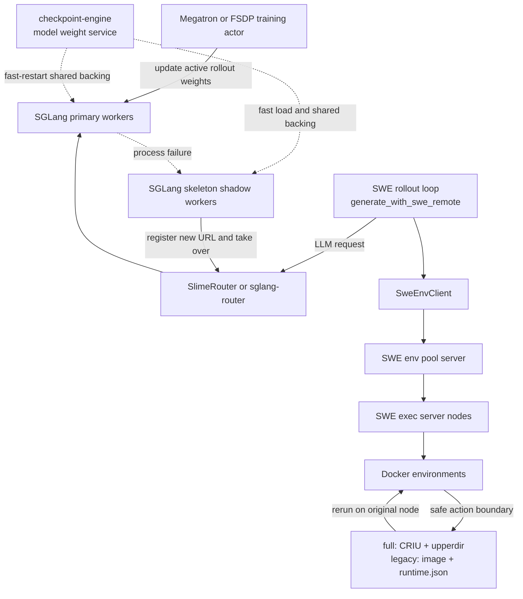

# Belayer

[English](README_EN.md) | 中文

> 面向 LLM 强化学习与 Agentic RL 的分层容错系统

**运行环境**：slime 官方镜像 `slime/slime:v0.2.2`。

Belayer 构建在 [slime](slime/)、[SGLang](sglang/)、[Megatron-LM](Megatron-LM/) 和远程 Docker SWE 环境之上，目标是在长时间、多轮、异构的 LLM RL rollout 中，缩小故障影响范围并减少重复计算。系统不把所有问题都交给“整作业重启”，而是在最接近故障的位置分别处理环境状态和推理服务中断。

当前项目聚焦两个设计：

1. **Env checkpoint**：默认通过 Docker-managed CRIU checkpoint 与 overlay upperdir 快照同时保存容器进程/内存和文件系统，并保留原 `docker commit + runtime.json` legacy backend；当前已接入的显式故障注入路径可从最近安全点继续，自然 OOM、transport error 和普通 exec exception 尚未统一触发自动 rerun。
2. **Rollout engine instant restart**：为 SGLang rollout engine 预启动 shadow worker；primary 故障后快速接管，并处理 endpoint 切换和后续权重更新重连；启用 custom SlimeRouter 时还可续跑在途 streaming generation。

本文只描述 `Belayer/` 内的当前实现。已有设计稿用于解释背景，但当设计稿与代码不一致时，以当前代码行为为准。

## 1. 为什么需要分层容错

Agentic RL 的一次 rollout 同时跨越三种状态：

- **模型服务状态**：SGLang engine、模型权重、KV buffer、router 中的在途 generation；
- **环境执行状态**：Docker 文件系统、代码修改、依赖安装、当前工作目录和 Python 环境；
- **rollout 控制状态**：对话消息、step 游标、reward/PRM 任务以及尚未写入训练 buffer 的样本。

三类状态的生命周期和恢复成本不同。只保存训练模型 checkpoint，不能恢复 `/testbed` 中已经完成的修改；只恢复 Docker 容器，也不能让已经断开的 generation 自动续跑。因此 Belayer 将容错拆成两个互补闭环：

| 层次 | 主要故障或压力 | 核心机制 | 保护粒度 |
|---|---|---|---|
| Environment state | 容器被杀、环境进度丢失 | Docker env checkpoint；显式故障注入时 rerun | 单 lease、单 trajectory step |
| Rollout serving | SGLang primary 进程退出或失联 | shadow handover + router recovery | 单 engine group、单 generation |

这里有三个容易混淆的 “checkpoint” 概念：

| 名称 | 保存或提供的对象 | 用途 |
|---|---|---|
| **Env checkpoint** | 默认：CRIU 进程/内存 + overlay upperdir；legacy：commit image + `runtime.json` | 恢复 SWE/agent 环境 |
| **checkpoint-engine** | 推理权重的持久共享 backing / parameter service | primary/shadow 共享 backing 与快速恢复装载 |
| **Training checkpoint** | 模型、optimizer、LR scheduler、RNG、训练 step | Megatron/FSDP 训练作业恢复 |

三者互补，但不能互相替代。本文所说的 Docker “full checkpoint” 是 `docker-full-checkpoint` 提供的 **Docker-managed CRIU runtime checkpoint + 可写层快照**；它恢复容器内长驻进程和内存，但仍不等同于训练模型 checkpoint。

## 2. 总体架构



核心数据路径是：训练 actor 通过权重更新通信更新 active rollout engine；在 fast-restart 配置中，checkpoint-engine 为 primary/shadow 提供持久共享的权重 backing 与恢复装载能力；rollout 通过 router 调用 SGLang，并通过 `SweEnvClient` 操作远程 Docker 环境；环境执行完成后产生 observation，再进入下一轮 LLM generation。两个容错设计分别嵌入这条路径的不同位置，不要求每次局部故障都停止整个训练作业。

## 3. 设计一：Env checkpoint

### 3.1 保护对象与一致性边界

Env checkpoint 以单个 SWE lease 为单位，并提供两个可共存 backend：

- **`full`（默认）**：`docker checkpoint create` 生成 Docker/runc 可恢复的 CRIU runtime images，同时打包 overlay upperdir；Belayer record 在宿主机保存 lease/generation、step、`cwd`、runtime env、artifact path、大小与分阶段 timing。
- **`legacy`**：保留原 `docker commit` node-local image，并把 `/tmp/swe-runtime-checkpoints/<checkpoint_id>/runtime.json` 写入 image；可通过 `SWE_CHECKPOINT_BACKEND=legacy` 或单次请求的 `checkpoint_backend=legacy` 显式选择。

checkpoint 只在安全 action 边界创建：上一条 `docker exec` 已完成，下一步 LLM generation 已经开始。Exec server 还为同一容器提供 shared exec gate 和 exclusive checkpoint/rerun gate，避免 commit 与前台命令交叉。已经排队的 exec 优先于 checkpoint，降低 checkpoint 阻塞正常环境执行的概率。

Docker-managed checkpoint 会先停止 source。Belayer 在仍持有同一个 container exclusive gate 时立刻对 source ID 做一次原地 `full_resume`，验证 Docker ID 未变化、容器重新 running 且保留 `docker exec`，最后才把 record 标为 `ready`。因此 full backend 能保存容器 init 及其 process tree 的 PID、内存中的 Python 对象和运行进度；当前不能假设它会恢复独立通过 `docker exec -d` 启动的后台 service。legacy backend 仍只保存文件系统与最小 runtime contract。两者都不保存 Docker volume、bind mount、宿主机文件或外部系统副作用。

### 3.2 创建路径与 LLM bubble overlap

当前 full 创建路径为：

```text
checkpoint policy
  -> SweEnvClient
  -> env pool: lease -> node/container
  -> exec server checkpoint dispatcher
  -> acquire per-container exclusive gate
  -> Docker-managed CRIU checkpoint (source stops)
  -> snapshot overlay upperdir and persist artifact
  -> full_resume to the same source container ID
  -> verify running / docker exec and clean installed copy
  -> persist ready/failed record
  -> return checkpoint_id to rollout
```

legacy 分支仍执行 `probe runtime env -> write runtime.json -> docker commit`，并按 checkpoint record 自身的 backend 恢复和 GC；升级前没有 backend 字段的历史 record 自动解释为 legacy。

Exec server 内部使用 dispatcher worker，但当前 HTTP/API 语义是**同步 create**：调用方会等到 checkpoint `ready` 或 `failed` 后才返回；旧的独立 `probe` 和 `status` 轮询接口已经废弃。

同步并不意味着 checkpoint 必然完全暴露在 rollout 关键路径上。Rollout 会先启动下一步 LLM task，再在等待 LLM 响应时调用 checkpoint。full checkpoint/原地 resume 或 legacy commit 与 GPU generation 可以并行：若 checkpoint 先结束，其耗时被 LLM wait 隐藏；若 LLM 先结束，checkpoint 的尾部才成为可见开销。Client create HTTP deadline 默认 600 秒、rerun 默认 300 秒，避免底层 Docker-managed 120 秒命令仍在运行时上层产生 ambiguous timeout。

### 3.3 Checkpoint policy

当前策略包括：

- `never`：不创建 env checkpoint，也是裸代码默认值；
- `always`：在每个满足条件的 LLM wait 中保存上一安全 step；
- `every-3`：每三个 step 尝试一次；
- `adaptive-risk`：根据预期恢复收益和可见 checkpoint 开销在线决策；
- `oracle-no-fault-no-checkpoint`：用于实验对照，不是在线容错策略。

`adaptive-risk` 从历史 trajectory 的 LLM latency 构造经验 tail model，并比较：

```text
expected_benefit
  = failure_probability
  × P(LLM 在给定等待时间后仍会继续运行)
  × checkpoint 之后需要重做的 env + LLM cost
```

只有预期收益大于 checkpoint 的预期可见开销，同时满足最小受保护成本和 checkpoint step 间隔时，才会在当前 LLM bubble 中提交快照。这样把“多久保存一次”从固定周期问题转化为恢复收益与前台干扰之间的在线权衡。

### 3.4 恢复路径

当前 rollout 收到 `exec_result.fault_injected=true` 后，优先使用最近的 ready checkpoint：

1. Pool 保持原 `lease_id`，把 rerun 请求转发到原 `lease.node_url`。
2. full backend 由 `docker-full-checkpoint` 按 source metadata 创建 stopped target（包括 command/env/workdir/network 及 Memory/PidsLimit），再恢复 CRIU runtime 和 upperdir；legacy backend 从 checkpoint image 创建新容器。
3. full target 验证 Docker-managed running/exec、`cwd` 与 runtime env；legacy target 读取 `runtime.json`，校验 repo、venv/conda 路径和 Python executable。
4. 校验成功后销毁旧容器，并把新 `container_id`、runtime env 和 `cwd` 写入 active metadata。
5. Pool 增加 lease generation；rollout 将 messages、step debug、PRM task 和 step 游标回退到 checkpoint 对应位置后继续。
6. 若没有可用 checkpoint，或 checkpoint rerun 失败，则从 base image 分配新 lease 并从 step 0 重新开始。

Checkpoint records 维护 parent lineage，并提供 list/delete/GC。full GC 删除 durable artifact directory，legacy GC 删除 commit image；二者都保留 record lineage 的祖先保护。Pool 用 per-lease lifecycle lock 串行 checkpoint/rerun/close，并在同步 create ready 后直接更新 latest pointer。

### 3.5 当前边界

- Full artifact、legacy image 和 metadata 都是 **node-local**；当前实现要求同一 kernel、Docker storage driver 和原 image lower layers，原 Docker 节点失联时不能跨节点恢复。
- 自动 rerun 当前只由 `exec_result.fault_injected=true` 分支触发。普通 transport error、自然 OOM 或普通 exec exception 尚未统一归一化到这条恢复路径。
- Full v1 不支持 bind/named/anonymous volume、tmpfs、TTY、GPU/device、rootless Docker、跨主机和可靠 TCP 连接恢复；当前验证网络模式为 `host`。
- 当前 Docker 29 实测的进程连续性边界是容器 init 及其 process tree；独立通过 `docker exec -d` 启动的后台进程没有在强化验证中继续更新，不能依赖它被恢复。
- Full backend 要求 root、CRIU、Docker experimental checkpoint、legacy overlay2 metadata 和 private/rprivate cgroup propagation；部署脚本会安装/检查这些条件。
- 若 full checkpoint 已停 source 后失败，Belayer 会在 exclusive gate 内尝试 plain `docker start` 以恢复可访问性，但明确记录 `state_continuity=false`、`source_recovery_mode=plain_restart`，不会把该 checkpoint 标为 ready。
- `runtime.json` 只属于 legacy backend；full backend 的 runtime env/lease ownership 保存于外部 record。
- 当前 GC 没有完整的自动 TTL/磁盘预算；线性 lineage 的祖先保护也可能使 `keep_latest=1` 保留整条链。

主要实现：

- [`swe-rl/generate_with_swe_remote.py`](swe-rl/generate_with_swe_remote.py)
- [`swe-rl/checkpoint_policy_runtime.py`](swe-rl/checkpoint_policy_runtime.py)
- [`swe-rl/swe_env_client.py`](swe-rl/swe_env_client.py)
- [`swe-rl/server/swe_env_pool_server.py`](swe-rl/server/swe_env_pool_server.py)
- [`swe-rl/server/swe_exec_server.py`](swe-rl/server/swe_exec_server.py)

## 4. 设计二：Rollout engine instant restart 与 router recovery

### 4.1 Instant restart 的含义

Instant restart 的 fast path 不是故障后从磁盘重新启动一个完整 SGLang engine，而是为每个本地 regular rollout engine 预先启动一个 `skeleton_worker` shadow：

- primary 先正常启动并注册 router；
- shadow 使用独立 HTTP/NCCL/dist-init 端口；
- shadow 开启 `enable_memory_saver`，通过代码当前命名的 `load_format=weight_deamon` 连接 checkpoint-engine，并依赖 `SGLANG_KV_CACHE_SOCKET_PATH` 暴露的共享 KV buffer；
- rollout 开始前可等待 shadow ready，并预留 stabilization 时间。

参数与 KV sidecar 共享的是 GPU buffer，不是 primary scheduler 中在途 request 的完整控制状态。Shadow 激活后会 flush cache；在途请求恢复依赖 router 保存的 token 前缀重新 prefill。

因此 “instant” 表示省去模型 cold load 和大部分初始化开销，而不是严格的零延迟或进程内存无缝迁移。

### 4.2 两级故障检测与 handover

Fast path 有两级检测：

1. **Engine actor 内 watcher** 每约 0.2 秒检查 primary process。一旦进程退出，立即 probe 并 promote shadow；这是进程 crash 的主要快速路径。
2. **RolloutHealthMonitor** 在 generate/eval 期间检查 engine process 和 `/health`。连续失败达到阈值后，先尝试整个 engine group 的 shadow handover；任何节点失败才进入完整重启。

SGLang skeleton 自身还通过 heartbeat 判断 primary 是否消失，并从 standby 进入 active。由此实际接管仍包含 heartbeat timeout、CUDA graph resume 和 cache flush，延迟不是零。

Promotion 使用 lock 和 pending event 保证 watcher 与 health monitor 重复调用时基本幂等，并按以下顺序切换：

1. 检查 shadow readiness；
2. **先注册 shadow 新 URL**；
3. 再摘除旧 primary URL；
4. kill/回收旧进程；
5. Ray actor 保持存活，只把内部 active process/server endpoint 切换到 shadow；
6. 记录下一次 weight update 必须重连的事件。

Health monitor 发起的多节点 group handover 要求组内每个节点 promotion 都成功，否则进入完整 engine restart；actor-local watcher 的 crash fast path 当前按节点独立接管，没有 group barrier。

### 4.3 Router 的 worker incarnation 管理

Custom `SlimeRouter` 为每个 engine node 使用稳定逻辑 key：

```text
worker_type:rank=<rank>:node_rank=<node_rank>
```

Router 同时维护 URL、stable key、单调 registration sequence 和 recovery event。Shadow 用相同 key 注册新 URL 后，router 可以区分“同一逻辑 worker 的新 incarnation”和旧连接。旧请求释放 reservation 时还会校验 sequence，避免错误修改新 incarnation 的 active-request count。

新请求按 active request 最少选择 worker，平局时 round-robin。非 `v1/*` 的普通 catch-all 代理请求发生连接错误时，可以排除失败 URL 后重试其他 worker。

这些 stable-key 和 token-level 语义只属于 `--use-slime-router` 路径。该开关裸代码默认关闭，当前 SWE 集成 launcher 也没有默认启用；fault-tolerance smoke scripts 才会显式打开。因此 shadow handover 可以配合标准 `sglang-router` 完成 endpoint 切换，但下述 token continuation 是 opt-in 能力。标准 router 提供自己的健康检查和整请求 retry，不提供 SlimeRouter 进程内 token checkpoint。

### 4.4 在途 generation 恢复

对 streaming `/generate`，SlimeRouter 会消费上游 SSE，并累计：

- output token IDs；
- token logprobs、token-id logprobs 和 top logprobs；
- 已完成 text prefix。

Router 每隔可配置的 N 个 token 建立一个**进程内 token checkpoint**。当旧 worker stream 断开时，router 回退到最近 token checkpoint，等待 replacement URL，然后构造：

```text
input_ids = original_input_ids + retained_output_ids
remaining_max_new_tokens = original_max_new_tokens - len(retained_output_ids)
```

新 worker 从保留前缀重新 prefill 并继续生成。若 router 主动观察到 stable key 已切换新 URL，则可以使用已观察到的全部 token 立即改道。该机制恢复的是 token 前缀，不保存 sampling RNG 或 scheduler/KV request state；随机采样时不保证故障轨迹与无故障轨迹逐 token 完全一致。

默认启用 custom router 时，失败请求等待同一 stable key 的更高 registration sequence，等待时间默认为无限。设置 `SLIME_ROUTER_REROUTE_FAILED_REQUESTS_TO_HEALTHY_WORKERS=1` 后，才会优先迁往其他仍注册的 least-loaded worker。`/generate_nonstream` 只能整请求 restart；设置 `SLIME_ROUTER_DISABLE_TOKEN_LEVEL_RECOVERY=1` 也会丢弃 partial tokens 后从头重试。

Token checkpoint 只在 router 内存中；router 进程本身退出会丢失它。

### 4.5 下一次 weight update 重连

Shadow promotion 后，旧 primary 的 NCCL/IPC weight-update control group 已失效。每个 engine actor 会记录一次性 reconnect event；RolloutManager 在下一次 `get_rollout_engines_and_lock()` 时收集并按 engine group 去重，把它计入 `num_new_engines`。

Megatron/FSDP actor 在真正推送下一版权重前重建 weight-update connections，并在成功后以 decrement 和 ack 语义消费事件，避免重连期间新到达的 handover 被整表清空。重连发生在**下一次 weight update**，不是 handover 的同步关键路径。

### 4.6 降级路径与当前边界

- Shadow 不可用时，health monitor 会 suppress 对应 group、kill 旧 Ray actors、在原 placement group 重建 engine，然后解除 suppress。
- Fast restart 关闭时，部分单节点故障可从健康 engine 使用 remote-instance loader 获取权重；seed 不健康则回退 storage load。
- Handover 当前是**一次性保护**：promotion 后不会自动补建新的 shadow；第二次故障要等完整 engine restart，重建后才重新获得 shadow。
- Primary 与 shadow 仍位于同一 engine host/GPU 故障域；节点、GPU 或 KV/weight sidecar 故障可能同时破坏两者。
- Custom router 没有独立 worker health loop；可选 “reroute to healthy worker” 中的 healthy 实际表示仍在注册表中的 alternate worker。
- Router、checkpoint-engine parameter service 和 KV sidecar 本身仍是需要单独保护的控制面/依赖。

主要实现：

- [`slime/slime/backends/sglang_utils/sglang_engine.py`](slime/slime/backends/sglang_utils/sglang_engine.py)
- [`slime/slime/utils/health_monitor.py`](slime/slime/utils/health_monitor.py)
- [`slime/slime/ray/rollout.py`](slime/slime/ray/rollout.py)
- [`slime/slime/router/router.py`](slime/slime/router/router.py)
- [`slime/slime/backends/megatron_utils/actor.py`](slime/slime/backends/megatron_utils/actor.py)
- [`slime/slime/backends/fsdp_utils/actor.py`](slime/slime/backends/fsdp_utils/actor.py)
- [`checkpoint-engine/`](checkpoint-engine/)
- [`sglang/`](sglang/)

## 5. 两个设计如何协同

一次正常的 agent step 可以概括为：

1. Rollout 通过 router 请求 LLM，得到 action 后在远程 Docker 环境执行。
2. Action 完成后，checkpoint policy 可以在下一步 LLM wait 中保存这一安全环境状态。
3. 如果 SGLang primary 在 generation 中退出，shadow 接管 endpoint；启用 custom SlimeRouter 时还可从保留 token prefix 续跑，Docker 环境无需重建。
4. 如果当前已接入的显式 Docker 环境故障在 action 前或 action 中被触发，rollout 从最近 env checkpoint 回退；router/engine 无需随之重启。

这形成了两种不同的“损失上界”：

- env checkpoint 把环境重做量限制到最近安全 action 之后；
- 启用 custom SlimeRouter 时，router token checkpoint 把在途 generation 的重做量限制到最近 token prefix 之后；标准 router 路径仍使用其整请求 retry。

两种保护机制的状态粒度不同，也分别依赖不同的存活控制面。环境恢复依赖 rollout Python 状态仍在；可选的 token 续跑依赖 custom SlimeRouter 仍在；训练作业级恢复仍依赖 Megatron/FSDP training checkpoint。

## 6. 配置入口

| 机制 | 关键入口 |
|---|---|
| Env checkpoint | `SWE_ENABLE_CHECKPOINT`、`SWE_CHECKPOINT_BACKEND=full\|legacy`、`SWE_CHECKPOINT_POLICY`、`SWE_CHECKPOINT_DIR`、`SWE_CHECKPOINT_MAX_INFLIGHT` |
| Full checkpoint | `SWE_FULL_CHECKPOINT_PROJECT_ROOT`、`SWE_FULL_CHECKPOINT_STATE_ROOT`、`SWE_FULL_CHECKPOINT_DOCKER_ROOT`、`SWE_FULL_CHECKPOINT_RUNTIME_STAGING_ROOT`、`SWE_FULL_CHECKPOINT_CRIU_TIMEOUT_SEC` |
| Checkpoint HTTP deadline | Client: `SWE_CHECKPOINT_CREATE_HTTP_TIMEOUT_SEC`、`SWE_CHECKPOINT_RESUME_HTTP_TIMEOUT_SEC`；pool→exec: `SWE_CHECKPOINT_CREATE_FORWARD_TIMEOUT_SEC` |
| Adaptive policy | `SWE_ADAPTIVE_TAIL_ROOT`、`SWE_ADAPTIVE_FAILURE_PROB`、`SWE_ADAPTIVE_CHECKPOINT_BUDGET_SEC`、最小 step/cost 间隔 |
| Engine fault tolerance | `--use-fault-tolerance`、health-check interval/timeout/first-wait |
| Shadow fast restart | `--sglang-enable-fast-restart`、KV socket、weight server base port、GPU mapping、ready/stabilization timeout |
| SlimeRouter recovery | `--use-slime-router` 及 `SLIME_ROUTER_GENERATE_*`、reroute、token recovery 配置 |

具体 launcher 的文件名不能替代实际配置检查：当前部分名为 `adaptive_checkpoint` 或 `static_checkpoint` 的 wrapper 仍可能把 policy 默认设为 `never`。运行实验前应以最终导出的环境变量和 CLI 参数为准。

## 7. 仓库结构与阅读顺序

```text
Belayer/
├── docker-full-checkpoint/ # Git submodule；Docker-managed CRIU + upperdir checkpoint/resume
├── slime/              # RL orchestration、RolloutManager、health monitor、router、fast restart
├── swe-rl/             # SWE agent rollout、远程 Docker、env checkpoint
├── checkpoint-engine/  # 推理权重快速装载与更新服务
├── sglang/             # SGLang runtime、skeleton worker、KV/weight 共享支持
├── Megatron-LM/        # 分布式训练后端
└── fault-inject-slime/ # 独立的故障注入与恢复实验副本
```

`docker-full-checkpoint/` 是独立仓库的 Git submodule。首次拉取 Belayer 时使用
`git clone --recurse-submodules`，已有工作区使用
`git submodule update --init --recursive`。

建议按以下顺序阅读：

1. 本文：两层容错的整体关系；
2. [`swe-rl/docs/cn/SWE_ENV_CHECKPOINT_DESIGN.md`](swe-rl/docs/cn/SWE_ENV_CHECKPOINT_DESIGN.md)：env checkpoint 的设计背景；
3. [`swe-rl/docs/swe_runtime_memory_recovery_plan.md`](swe-rl/docs/swe_runtime_memory_recovery_plan.md)：filesystem 与 runtime state 的边界；
4. [`swe-rl/docs/cn/SWE_CHECKPOINT_DEBUG_WORKFLOW.md`](swe-rl/docs/cn/SWE_CHECKPOINT_DEBUG_WORKFLOW.md)：checkpoint replay 与 fault experiment；
5. [`slime/docs/fast_restart.md`](slime/docs/fast_restart.md)：shadow fast restart 摘要；
6. 上述每节列出的当前实现文件和 tests。

需要注意：env checkpoint 设计稿仍保留早期“异步 create + status/probe”方案，而当前实现已经改为同步 create。阅读旧文档时应结合当前代码确认。

## 8. 验证与实验资产

Env checkpoint：

- [`swe-rl/tests/test_swe_exec_checkpoint.py`](swe-rl/tests/test_swe_exec_checkpoint.py)
- [`swe-rl/tests/test_swe_exec_full_checkpoint.py`](swe-rl/tests/test_swe_exec_full_checkpoint.py)
- [`swe-rl/tests/test_swe_env_pool_checkpoint.py`](swe-rl/tests/test_swe_env_pool_checkpoint.py)
- [`swe-rl/tests/test_checkpoint_policy_runtime.py`](swe-rl/tests/test_checkpoint_policy_runtime.py)
- [`swe-rl/tools/benchmark_full_checkpoint_adapter.py`](swe-rl/tools/benchmark_full_checkpoint_adapter.py)
- [`swe-rl/tools/validate_swe_checkpoint_correctness.py`](swe-rl/tools/validate_swe_checkpoint_correctness.py)
- [`swe-rl/tools/replay_swe_checkpoint_fault_experiment.py`](swe-rl/tools/replay_swe_checkpoint_fault_experiment.py)

Instant restart 与 router：

- [`slime/tests/test_fast_restart.py`](slime/tests/test_fast_restart.py)
- [`slime/tests/test_router_failover.py`](slime/tests/test_router_failover.py)
- [`slime/scripts/fault_tolerance/`](slime/scripts/fault_tolerance/)
- [`sglang/test/manual/test_shadow_worker_handover.py`](sglang/test/manual/test_shadow_worker_handover.py)

当前仓库存在一定的测试漂移：fast-restart tests 有若干 mock 与当前 health API 不一致。因此这些文件代表了已有覆盖意图和实验入口，但不能把整个测试目录当前全绿作为既成事实。

## 9. 当前容错边界

Belayer 当前主要保护 rollout 与 environment data plane，尚不等于完整的作业级高可用系统：

- 训练 actor、optimizer 和全局 step 的恢复仍由训练 checkpoint 负责；
- Ray head、router、pool server、checkpoint-engine、KV sidecar 和整节点故障需要额外的服务级冗余；
- Env checkpoint 不能恢复跨节点状态、外部 volume 或不可回滚的远程副作用；
- Shadow handover 不保证 sampling bitwise deterministic，也不能覆盖同时失去 primary 与 shadow 的故障；
- 真实自然故障的分类、自动恢复触发、跨节点 checkpoint、自动 GC/磁盘治理和全链路一致性验证仍是后续工程化重点。

因此，Belayer 更准确的定位是：**围绕 LLM RL rollout 关键路径构建的分层容错原型与实验平台**。它已经提供显式故障注入路径下的环境级回滚、推理引擎快速接管，以及 custom SlimeRouter 路径下可选的请求级续跑，同时保留了将这些局部闭环扩展为作业级高可用系统的接口与验证工具。
