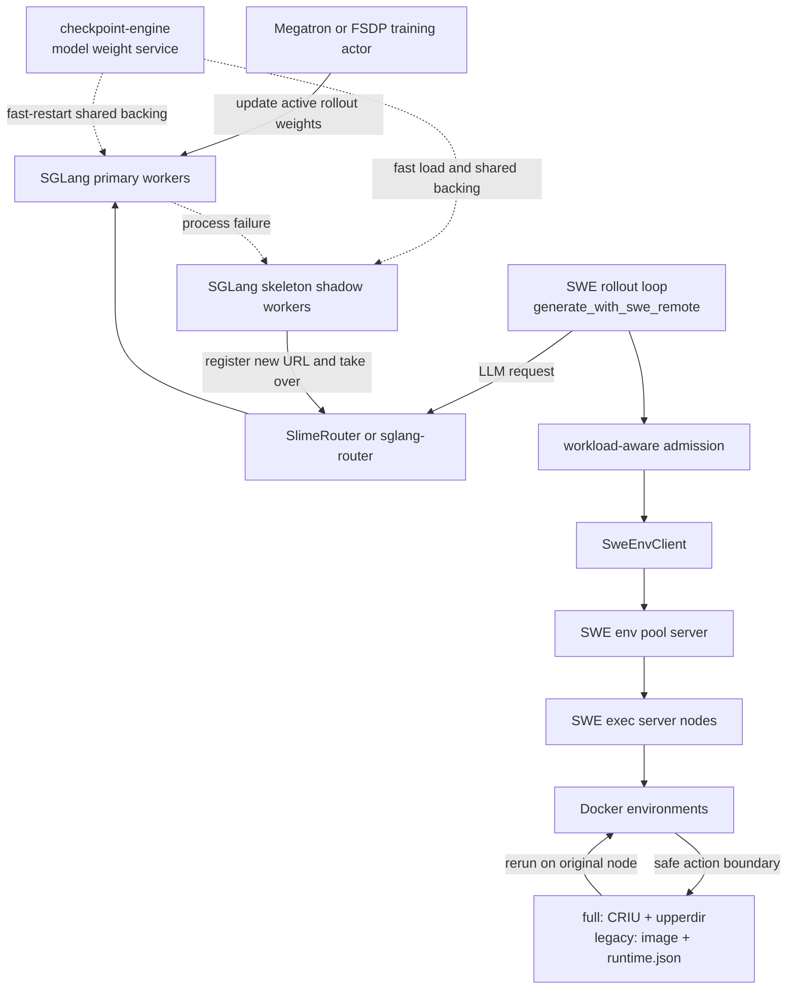

# Belayer

English | [中文](README.md)

> A layered fault-tolerance system for LLM reinforcement learning and Agentic RL

**Runtime environment**: the official slime image `slime/slime:v0.2.2`.

Belayer is built on [slime](slime/), [SGLang](sglang/), [Megatron-LM](Megatron-LM/), and remote Docker-based SWE environments. Its goal is to reduce the blast radius of failures and avoid repeated computation during long-running, multi-turn, heterogeneous LLM RL rollouts. Instead of handling every problem by restarting the entire job, the system addresses environment state loss, resource pressure, and inference-service interruptions separately, as close as possible to where each failure occurs.

The project currently focuses on three designs:

1. **Env checkpoint**: By default, Docker-managed CRIU checkpoints and overlay upperdir snapshots jointly preserve container process/memory state and the filesystem. The original `docker commit + runtime.json` legacy backend is retained. The currently integrated explicit fault-injection path can continue from the latest safe point; natural OOMs, transport errors, and ordinary exec exceptions do not yet share a unified automatic-rerun path.
2. **Env workload-aware scheduling**: Four-dimensional admission control and dynamic reordering use historical workload profiles together with the cluster's current residual resources to smooth load before OOMs, CPU/I/O contention, and Docker create storms occur.
3. **Rollout engine instant restart**: Shadow workers are started ahead of time for SGLang rollout engines. When a primary fails, a shadow quickly takes over, including endpoint switching and reconnection for subsequent weight updates. When the custom SlimeRouter is enabled, in-flight streaming generations can also continue.

This document describes only the current implementation under `Belayer/`. Existing design documents explain the background, but where they differ from the code, the current code behavior takes precedence.

## 1. Why Layered Fault Tolerance Is Needed

A single Agentic RL rollout spans three kinds of state:

- **Model-serving state**: SGLang engines, model weights, KV buffers, and in-flight generations held by the router;
- **Environment-execution state**: the Docker filesystem, code changes, installed dependencies, the current working directory, and the Python environment;
- **Rollout-control state**: conversation messages, the step cursor, reward/PRM tasks, and samples not yet written to the training buffer.

These state classes have different lifetimes and recovery costs. A training-model checkpoint alone cannot restore completed changes under `/testbed`; restoring only a Docker container cannot automatically continue a disconnected generation; restarting only a rollout engine cannot prevent host OOMs caused by many heterogeneous environments starting simultaneously. Belayer therefore decomposes fault tolerance into three complementary loops:

| Layer | Primary failure or pressure | Core mechanism | Protection granularity |
|---|---|---|---|
| Environment state | Container termination or lost environment progress | Docker env checkpoint; rerun for explicit fault injection | One lease, one trajectory step |
| Environment capacity | Memory/CPU/disk overload or startup storms | Workload profile + budgeted admission | One prompt, one cluster resource window |
| Rollout serving | SGLang primary process exits or becomes unreachable | Shadow handover + router recovery | One engine group, one generation |

Three different uses of the word "checkpoint" are easy to confuse:

| Name | What it stores or provides | Purpose |
|---|---|---|
| **Env checkpoint** | Default: CRIU process/memory + overlay upperdir; legacy: commit image + `runtime.json` | Restore the SWE/agent environment |
| **checkpoint-engine** | Persistent shared backing / parameter service for inference weights | Shared backing and fast recovery loading for primary/shadow workers |
| **Training checkpoint** | Model, optimizer, LR scheduler, RNG, and training step | Recover Megatron/FSDP training jobs |

The three are complementary but not interchangeable. The Docker "full checkpoint" discussed here is the **Docker-managed CRIU runtime checkpoint + writable-layer snapshot** provided by `docker-full-checkpoint`. It restores long-lived processes and memory inside a container, but it is still not equivalent to a training-model checkpoint.

## 2. Overall Architecture



The main data path is as follows: the training actor updates the active rollout engine through weight-update communication; under fast-restart configuration, checkpoint-engine provides persistent shared weight backing and recovery loading for primary and shadow workers; rollouts invoke SGLang through the router and operate remote Docker environments through `SweEnvClient`; once an environment action completes, its observation feeds the next LLM generation. The three fault-tolerance designs are inserted at different points along this path, so a local failure does not necessarily stop the entire training job.

## 3. Design One: Env Checkpoint

### 3.1 Protected State and Consistency Boundary

Env checkpoints operate on one SWE lease at a time and provide two backends that can coexist:

- **`full` (default)**: `docker checkpoint create` produces Docker/runc-compatible CRIU runtime images while the overlay upperdir is archived. A host-side Belayer record stores the lease/generation, step, `cwd`, runtime environment, artifact path, size, and per-stage timings.
- **`legacy`**: The original node-local `docker commit` image is retained, with `/tmp/swe-runtime-checkpoints/<checkpoint_id>/runtime.json` written into the image. Select it explicitly with `SWE_CHECKPOINT_BACKEND=legacy` or `checkpoint_backend=legacy` on an individual request.

Checkpoints are created only at safe action boundaries: the previous `docker exec` has completed and the next LLM generation has already begun. The exec server also provides a shared exec gate and an exclusive checkpoint/rerun gate for each container, preventing a commit from overlapping a foreground command. Already queued exec requests take priority over checkpoints, reducing the chance that checkpointing blocks normal environment execution.

A Docker-managed checkpoint first stops the source container. While still holding the same container-exclusive gate, Belayer immediately performs an in-place `full_resume` using the source ID. It verifies that the Docker ID is unchanged, that the container is running again, and that `docker exec` remains available; only then is the record marked `ready`. The full backend can therefore preserve the PIDs, in-memory Python objects, and execution progress of the container init process and its process tree; it must not currently be assumed to restore a background service launched independently through `docker exec -d`. The legacy backend still preserves only the filesystem and a minimal runtime contract. Neither backend captures Docker volumes, bind mounts, host files, or side effects in external systems.

### 3.2 Creation Path and LLM-Bubble Overlap

The current full-checkpoint creation path is:

```text
checkpoint policy
  -> SweEnvClient
  -> env pool: lease -> node/container
  -> exec server checkpoint dispatcher
  -> acquire per-container exclusive gate
  -> Docker-managed CRIU checkpoint (source stops)
  -> snapshot overlay upperdir and persist artifact
  -> full_resume to the same source container ID
  -> verify running / docker exec and clean installed copy
  -> persist ready/failed record
  -> return checkpoint_id to rollout
```

The legacy branch still performs `probe runtime env -> write runtime.json -> docker commit`. Recovery and GC follow the backend stored in each checkpoint record; historical records created before the backend field was introduced are automatically interpreted as legacy records.

The exec server uses dispatcher workers internally, but the current HTTP/API semantics are **synchronous create**: the caller waits until the checkpoint becomes `ready` or `failed`. The former standalone `probe` and `status` polling endpoints are deprecated.

Synchronous creation does not mean the entire checkpoint latency is necessarily exposed on the rollout critical path. The rollout starts the next LLM task first, then invokes checkpointing while waiting for the LLM response. A full checkpoint/in-place resume or legacy commit can run in parallel with GPU generation: if the checkpoint finishes first, its latency is hidden by the LLM wait; if the LLM finishes first, only the checkpoint tail becomes visible overhead. The client create HTTP deadline defaults to 600 seconds and the rerun deadline to 300 seconds, preventing an ambiguous timeout at the upper layer while a lower-level 120-second Docker-managed command is still running.

### 3.3 Checkpoint Policy

The current policies are:

- `never`: do not create env checkpoints; this is also the default in the bare code;
- `always`: save the preceding safe step during every eligible LLM wait;
- `every-3`: attempt a checkpoint every three steps;
- `adaptive-risk`: make online decisions using expected recovery benefit and visible checkpoint overhead;
- `oracle-no-fault-no-checkpoint`: an experimental control, not an online fault-tolerance policy.

`adaptive-risk` builds an empirical tail model from historical trajectory LLM latencies and compares:

```text
expected_benefit
  = failure_probability
  × P(the LLM will continue running beyond the elapsed wait)
  × env + LLM cost that would have to be repeated after the checkpoint
```

A snapshot is submitted within the current LLM bubble only when the expected benefit exceeds the expected visible checkpoint overhead and the minimum protected-cost and inter-checkpoint step constraints are satisfied. This turns "how often to save" from a fixed-period problem into an online trade-off between recovery benefit and foreground interference.

### 3.4 Recovery Path

When the current rollout receives `exec_result.fault_injected=true`, it first tries the latest ready checkpoint:

1. The pool retains the original `lease_id` and forwards the rerun request to the original `lease.node_url`.
2. For the full backend, `docker-full-checkpoint` creates a stopped target from the source metadata, including command/env/workdir/network and Memory/PidsLimit, then restores the CRIU runtime and upperdir. The legacy backend creates a new container from the checkpoint image.
3. A full target is checked for Docker-managed running/exec support, `cwd`, and runtime environment. A legacy target reads `runtime.json` and validates the repository, venv/conda paths, and Python executable.
4. After validation succeeds, the old container is destroyed and the new `container_id`, runtime environment, and `cwd` are written to active metadata.
5. The pool increments the lease generation. The rollout rewinds its messages, step-debug data, PRM tasks, and step cursor to the checkpoint position, then continues.
6. If no usable checkpoint exists, or checkpoint rerun fails, a new lease is allocated from the base image and execution restarts from step 0.

Checkpoint records maintain parent lineage and expose list/delete/GC operations. Full GC deletes the durable artifact directory, while legacy GC deletes the committed image; both preserve ancestors required by record lineage. The pool serializes checkpoint/rerun/close with a per-lease lifecycle lock and updates the latest pointer directly when synchronous creation returns a ready checkpoint.

### 3.5 Current Boundaries

- Full artifacts, legacy images, and metadata are all **node-local**. The current implementation requires the same kernel, Docker storage driver, and original image lower layers. It cannot recover on another node when the original Docker node is unavailable.
- Automatic rerun is currently triggered only by the `exec_result.fault_injected=true` branch. Ordinary transport errors, natural OOMs, and ordinary exec exceptions have not yet been normalized into the same recovery path.
- Full v1 does not support bind/named/anonymous volumes, tmpfs, TTY, GPUs/devices, rootless Docker, cross-host recovery, or reliable TCP-connection restoration. The currently validated network mode is `host`.
- Under Docker 29, the process-continuity boundary verified so far is the container init process and its process tree. A background process started independently through `docker exec -d` did not continue updating in strengthened validation and must not be assumed to recover.
- The full backend requires root access, CRIU, Docker experimental checkpoint support, legacy overlay2 metadata, and private/rprivate cgroup propagation. The deployment script installs or checks these prerequisites.
- If a full checkpoint fails after stopping the source, Belayer attempts a plain `docker start` while holding the exclusive gate to restore accessibility. It explicitly records `state_continuity=false` and `source_recovery_mode=plain_restart`, and does not mark that checkpoint ready.
- `runtime.json` belongs only to the legacy backend. For the full backend, runtime environment and lease ownership are stored in the external record.
- GC does not yet provide complete automatic TTL or disk-budget enforcement. Ancestor protection for a linear lineage may also cause `keep_latest=1` to retain the entire chain.

Main implementation:

- [`swe-rl/generate_with_swe_remote.py`](swe-rl/generate_with_swe_remote.py)
- [`swe-rl/checkpoint_policy_runtime.py`](swe-rl/checkpoint_policy_runtime.py)
- [`swe-rl/swe_env_client.py`](swe-rl/swe_env_client.py)
- [`swe-rl/server/swe_env_pool_server.py`](swe-rl/server/swe_env_pool_server.py)
- [`swe-rl/server/swe_exec_server.py`](swe-rl/server/swe_exec_server.py)

## 4. Design Two: Env Workload-Aware Scheduling

### 4.1 Role of the Design

The workload-aware scheduler is a **prompt-level resource admission controller** within a single rollout Python process. It uses aggregate cluster budgets to decide which prompt may begin consuming Docker-environment resources; the pool server still decides which node will host a particular container.

This mechanism primarily prevents failures rather than recovering after them. By limiting aggregate resource demand and the Docker creation rate, it reduces the likelihood of host OOMs, CPU/I/O congestion, dockerd instability, and simultaneous cold starts by many unknown workloads.

### 4.2 Workload Profiles

Scheduling uses a four-dimensional resource vector:

```text
R = (peak memory, average CPU, disk read, disk write)
```

Although some variables still use names such as `repo_resource_stats`, current profiles are actually keyed by **per-data / instance_id**. The repository is used primarily for display and as a fallback when `instance_id` is missing. Consequently, a new instance from the same repository may still take the cold-start path rather than inheriting the repository's profile automatically.

Profiles come from two sources:

- **Offline replay profiles**: replay historical trajectories and read each instance's memory peak, average CPU usage, cumulative disk I/O, and duration;
- **Online lease stats**: route batch stats through the pool to exec nodes and collect cgroup memory/CPU/I/O. Online updates and persistence are optional switches and are not enabled by every launcher by default.

When there is insufficient history, the scheduler multiplies the default prediction by cold-start memory/CPU multipliers and uses an unknown-workload concurrency cap to limit bursts.

### 4.3 Real-Time Budgets and Admission

Each exec node reports available memory, CPU capacity, and estimated disk bandwidth through `/host_stats`; the pool's `/status` aggregates healthy nodes into cluster-wide availability. The effective budget in each resource dimension is:

```text
budget[d] = cluster_available[d]
          × safety_margin
          × oversell_ratio[d]
```

To compensate for lag in live sampling, the scheduler also subtracts predicted resources already reserved by prompts admitted in the current process. A new prompt can start only if memory, CPU, disk read, and disk write all fit within their budgets, and if the active, startup, unknown-workload, and per-refresh-window admission caps are all respected.

If a single workload exceeds the entire budget and no prompt is active, the scheduler forcibly admits the oldest oversized prompt to prevent a permanent queue deadlock.

### 4.4 Dynamic Reordering

When input order is not enforced, the scheduler selects the highest packing score among all pending prompts that fit:

```text
score = four-dimensional residual fill
      + 0.6 × dominant-resource ratio
      + 0.4 × age bonus
```

The duration bonus and unknown penalty present in the current code have not yet been incorporated into the actual score. When preserve-order is enabled, the head of the queue is checked first; after repeatedly being blocked by the budget, it may be moved back to reduce head-of-line blocking.

The rollout maintains a sufficiently large pending window and submits candidates in grouped breadth-first order, allowing the scheduler to combine workloads with different resource shapes into multiple execution waves. Docker create operations also have independent concurrency and minimum-interval rate limits so admission does not simply produce another startup storm.

### 4.5 Feedback Loop and Recovery Coordination

After a prompt receives an admission ticket, both its agent lease and subsequent evaluation lease are associated with that ticket. When the prompt completes or exits exceptionally, a `finally` path closes the leases, releases semaphores and resource reservations, and may update the profile from a sampled summary. If a task is canceled while waiting for admission, there is currently no matching cleanup for the pending request.

An env-checkpoint rerun keeps the same `lease_id` and replaces only the `container_id` in the pool. The scheduler therefore continues to read stats through the same lease; a single container recovery neither requires readmission nor breaks prompt-level resource accounting.

### 4.6 Current Boundaries

- Four-dimensional admission uses a **cluster aggregate**. Pool placement merely chooses the healthy node with the fewest `active_containers`; it is not per-node resource bin packing.
- The scheduler is a singleton within one Python process. Multiple rollout processes do not share strongly consistent global reservations and coordinate only indirectly through the pool's `/status`, which has sampling delay.
- Disk workload profiles represent cumulative bytes, while host budgets are expressed in bytes per second. The current comparison is heuristic rather than strict resource isolation.
- The current key is an instance and does not provide repository-level generalization. If production configurations disable live profile updates, instances outside the offline profile continue to use cold-start predictions.
- Admission exceptions fail open to legacy order. Internal semaphores are usually large in scheduler mode, so monitoring this degradation path is important.
- Canceling a task that is waiting for admission can leave behind a pending request; this cleanup path remains to be implemented.
- `plan_prompt_order()` is an offline helper. Actual production reordering comes from online admission candidate selection.

Main implementation:

- [`swe-rl/online_env_docker_scheduler.py`](swe-rl/online_env_docker_scheduler.py)
- [`swe-rl/generate_with_swe_remote.py`](swe-rl/generate_with_swe_remote.py)
- [`swe-rl/server/swe_env_pool_server.py`](swe-rl/server/swe_env_pool_server.py)
- [`swe-rl/server/swe_exec_server.py`](swe-rl/server/swe_exec_server.py)
- [`slime/slime/rollout/sglang_rollout.py`](slime/slime/rollout/sglang_rollout.py)

## 5. Design Three: Rollout Engine Instant Restart and Router Recovery

### 5.1 Meaning of Instant Restart

The instant-restart fast path does not launch a complete SGLang engine from disk after a failure. Instead, it starts a `skeleton_worker` shadow in advance for every local regular rollout engine:

- The primary starts normally and registers with the router first;
- The shadow uses independent HTTP/NCCL/dist-init ports;
- The shadow enables `enable_memory_saver`, connects to checkpoint-engine using the currently named `load_format=weight_deamon`, and relies on the shared KV buffer exposed through `SGLANG_KV_CACHE_SOCKET_PATH`;
- Before rollout begins, the system can wait for the shadow to become ready and reserve a stabilization interval.

The parameter/weight and KV sidecars share GPU buffers, not the complete control state of in-flight requests in the primary scheduler. The shadow flushes its cache after activation; recovery of in-flight requests relies on the router retaining a token prefix and prefilling it again.

"Instant" therefore means avoiding a model cold load and most initialization overhead, not strictly zero delay or seamless migration of process memory.

### 5.2 Two-Level Failure Detection and Handover

The fast path has two levels of detection:

1. An **engine-actor-local watcher** checks the primary process about every 0.2 seconds. Once the process exits, it immediately probes and promotes the shadow. This is the main fast path for process crashes.
2. The **RolloutHealthMonitor** checks the engine process and `/health` during generation/evaluation. After consecutive failures reach the threshold, it first attempts shadow handover for the entire engine group; only if any node fails does it perform a complete restart.

The SGLang skeleton also uses a heartbeat to determine whether the primary has disappeared and transitions from standby to active. Actual takeover therefore still includes heartbeat timeout, CUDA graph resume, and cache flush; its latency is not zero.

Promotion uses a lock and pending event so repeated calls by the watcher and health monitor are largely idempotent, and switches in this order:

1. Check shadow readiness;
2. **Register the shadow's new URL first**;
3. Then remove the old primary URL;
4. Kill/reclaim the old process;
5. Keep the Ray actor alive and switch only its internal active process/server endpoint to the shadow;
6. Record an event requiring reconnection at the next weight update.

A multi-node group handover initiated by the health monitor requires promotion to succeed on every node in the group; otherwise it falls back to a complete engine restart. The actor-local watcher's crash fast path currently takes over nodes independently, without a group barrier.

### 5.3 Router Worker-Incarnation Management

The custom `SlimeRouter` uses a stable logical key for every engine node:

```text
worker_type:rank=<rank>:node_rank=<node_rank>
```

The router maintains the URL, stable key, monotonic registration sequence, and recovery event together. After a shadow registers a new URL using the same key, the router can distinguish a new incarnation of the same logical worker from the old connection. When an old request releases its reservation, it also checks the sequence number so it cannot accidentally modify the active-request count of the new incarnation.

New requests choose the worker with the fewest active requests, breaking ties with round-robin. For ordinary catch-all proxy requests outside `v1/*`, a connection error can trigger a retry on another worker while excluding the failed URL.

These stable-key and token-level semantics belong only to the `--use-slime-router` path. That switch is disabled by default in the bare code and is not enabled by default in the current SWE integration launcher; only fault-tolerance smoke scripts enable it explicitly. Shadow handover can therefore still switch endpoints when used with the standard `sglang-router`, but the token-continuation behavior below is opt-in. The standard router provides its own health checks and whole-request retries, but not SlimeRouter's in-process token checkpoints.

### 5.4 Recovery of In-Flight Generations

For streaming `/generate`, SlimeRouter consumes upstream SSE and accumulates:

- Output token IDs;
- Token logprobs, token-ID logprobs, and top logprobs;
- The completed text prefix.

The router creates an **in-process token checkpoint** every configurable N tokens. If the old worker's stream disconnects, the router rolls back to the latest token checkpoint, waits for a replacement URL, and constructs:

```text
input_ids = original_input_ids + retained_output_ids
remaining_max_new_tokens = original_max_new_tokens - len(retained_output_ids)
```

The new worker prefills the retained prefix and continues generation. If the router has actively observed that the stable key already switched to a new URL, it can redirect immediately using all tokens observed so far. This mechanism restores a token prefix, not sampling RNG or scheduler/KV request state; with stochastic sampling, it does not guarantee that the faulty and fault-free trajectories remain identical token by token.

When the custom router is enabled, a failed request waits by default for a higher registration sequence under the same stable key, with no timeout. Only after setting `SLIME_ROUTER_REROUTE_FAILED_REQUESTS_TO_HEALTHY_WORKERS=1` does it prefer another least-loaded worker that remains registered. `/generate_nonstream` can only restart the whole request; setting `SLIME_ROUTER_DISABLE_TOKEN_LEVEL_RECOVERY=1` likewise discards partial tokens and retries from the beginning.

Token checkpoints exist only in router memory and are lost if the router process itself exits.

### 5.5 Reconnection at the Next Weight Update

After shadow promotion, the old primary's NCCL/IPC weight-update control group is invalid. Every engine actor records a one-shot reconnect event. The RolloutManager collects and deduplicates these by engine group during the next `get_rollout_engines_and_lock()` call and includes them in `num_new_engines`.

The Megatron/FSDP actor rebuilds weight-update connections before actually pushing the next weight version. It consumes events using decrement-and-ack semantics only after reconnection succeeds, so a handover arriving during reconnection is not erased by clearing an entire table. Reconnection occurs at the **next weight update**, not on the synchronous handover critical path.

### 5.6 Degradation Paths and Current Boundaries

- When no shadow is available, the health monitor suppresses the affected group, kills the old Ray actors, recreates the engine in the original placement group, and then removes suppression.
- When fast restart is disabled, some single-node failures can obtain weights from a healthy engine through the remote-instance loader; if the seed is unhealthy, recovery falls back to storage loading.
- Handover currently provides **one-shot protection**: a new shadow is not created automatically after promotion. A second failure requires a full engine restart, which recreates shadow protection.
- The primary and shadow remain in the same engine host/GPU failure domain. A node, GPU, or KV/weight sidecar failure may break both simultaneously.
- The custom router has no independent worker-health loop. In the optional "reroute to healthy worker" mode, healthy actually means an alternate worker still present in the registry.
- The router, checkpoint-engine parameter service, and KV sidecar remain control-plane components/dependencies that need separate protection.

Main implementation:

- [`slime/slime/backends/sglang_utils/sglang_engine.py`](slime/slime/backends/sglang_utils/sglang_engine.py)
- [`slime/slime/utils/health_monitor.py`](slime/slime/utils/health_monitor.py)
- [`slime/slime/ray/rollout.py`](slime/slime/ray/rollout.py)
- [`slime/slime/router/router.py`](slime/slime/router/router.py)
- [`slime/slime/backends/megatron_utils/actor.py`](slime/slime/backends/megatron_utils/actor.py)
- [`slime/slime/backends/fsdp_utils/actor.py`](slime/slime/backends/fsdp_utils/actor.py)
- [`checkpoint-engine/`](checkpoint-engine/)
- [`sglang/`](sglang/)

## 6. How the Three Designs Work Together

A normal agent step can be summarized as follows:

1. The workload-aware scheduler uses the instance profile and cluster budget to decide whether the prompt may start.
2. The rollout requests an LLM through the router and executes the resulting action in a remote Docker environment.
3. After the action completes, the checkpoint policy may save this safe environment state during the next LLM wait.
4. If the SGLang primary exits during generation, the shadow takes over the endpoint. With the custom SlimeRouter enabled, generation can also continue from a retained token prefix, without rebuilding the Docker environment.
5. If one of the currently integrated explicit Docker-environment faults is triggered before or during an action, the rollout rolls back to the latest env checkpoint; the router/engine need not restart with it.
6. When the prompt finishes, its scheduler reservation is released and resource observations are fed back into the profile.

This establishes three different bounds on lost work:

- The scheduler attempts to prevent resource overload from losing an entire batch of concurrent tasks;
- Env checkpoints limit repeated environment work to actions after the latest safe boundary;
- With the custom SlimeRouter enabled, router token checkpoints limit repeated in-flight generation to tokens after the latest retained prefix. The standard-router path still uses its whole-request retry behavior.

The three protection mechanisms operate at different state granularities and depend on different surviving control-plane components. Environment recovery requires the rollout Python state to remain alive; optional token continuation requires the custom SlimeRouter to remain alive; training-job recovery still depends on Megatron/FSDP training checkpoints.

## 7. Configuration Entry Points

| Mechanism | Key entry points |
|---|---|
| Env checkpoint | `SWE_ENABLE_CHECKPOINT`, `SWE_CHECKPOINT_BACKEND=full\|legacy`, `SWE_CHECKPOINT_POLICY`, `SWE_CHECKPOINT_DIR`, `SWE_CHECKPOINT_MAX_INFLIGHT` |
| Full checkpoint | `SWE_FULL_CHECKPOINT_PROJECT_ROOT`, `SWE_FULL_CHECKPOINT_STATE_ROOT`, `SWE_FULL_CHECKPOINT_DOCKER_ROOT`, `SWE_FULL_CHECKPOINT_RUNTIME_STAGING_ROOT`, `SWE_FULL_CHECKPOINT_CRIU_TIMEOUT_SEC` |
| Checkpoint HTTP deadline | Client: `SWE_CHECKPOINT_CREATE_HTTP_TIMEOUT_SEC`, `SWE_CHECKPOINT_RESUME_HTTP_TIMEOUT_SEC`; pool→exec: `SWE_CHECKPOINT_CREATE_FORWARD_TIMEOUT_SEC` |
| Adaptive policy | `SWE_ADAPTIVE_TAIL_ROOT`, `SWE_ADAPTIVE_FAILURE_PROB`, `SWE_ADAPTIVE_CHECKPOINT_BUDGET_SEC`, and minimum step/cost intervals |
| Workload scheduler | `SWE_ENABLE_ONLINE_ENV_DOCKER_SCHEDULER` plus `SWE_SCHED_*` profile, budget, oversell, cold-start, and sampling settings |
| Engine fault tolerance | `--use-fault-tolerance`, health-check interval/timeout/first-wait |
| Shadow fast restart | `--sglang-enable-fast-restart`, KV socket, weight-server base port, GPU mapping, ready/stabilization timeout |
| SlimeRouter recovery | `--use-slime-router` plus `SLIME_ROUTER_GENERATE_*`, reroute, and token-recovery settings |

Launcher filenames are not a substitute for checking the effective configuration. Some current wrappers named `adaptive_checkpoint` or `static_checkpoint` may still default the policy to `never`. Before running an experiment, inspect the final exported environment variables and CLI arguments.

## 8. Repository Structure and Suggested Reading Order

```text
Belayer/
├── docker-full-checkpoint/ # Git submodule; Docker-managed CRIU + upperdir checkpoint/resume
├── slime/              # RL orchestration, RolloutManager, health monitor, router, fast restart
├── swe-rl/             # SWE agent rollout, remote Docker, env checkpoint, workload scheduler
├── checkpoint-engine/  # Fast loading and update service for inference weights
├── sglang/             # SGLang runtime, skeleton worker, shared KV/weight support
├── Megatron-LM/        # Distributed training backend
└── fault-inject-slime/ # Separate copy for fault-injection and recovery experiments
```

`docker-full-checkpoint/` is a Git submodule backed by a separate repository. When cloning Belayer for the first time, use `git clone --recurse-submodules`. For an existing working tree, use `git submodule update --init --recursive`.

Suggested reading order:

1. This document, for the overall relationship among the three fault-tolerance layers;
2. [`swe-rl/docs/cn/SWE_ENV_CHECKPOINT_DESIGN.md`](swe-rl/docs/cn/SWE_ENV_CHECKPOINT_DESIGN.md), for the design background of env checkpoints;
3. [`swe-rl/docs/swe_runtime_memory_recovery_plan.md`](swe-rl/docs/swe_runtime_memory_recovery_plan.md), for the boundary between filesystem and runtime state;
4. [`swe-rl/docs/cn/SWE_CHECKPOINT_DEBUG_WORKFLOW.md`](swe-rl/docs/cn/SWE_CHECKPOINT_DEBUG_WORKFLOW.md), for checkpoint replay and fault experiments;
5. [`slime/docs/fast_restart.md`](slime/docs/fast_restart.md), for a summary of shadow fast restart;
6. The current implementation files and tests listed in each section above.

Note that the env-checkpoint design document still retains the earlier "asynchronous create + status/probe" design, while the current implementation uses synchronous create. The scheduler granularity, default budgets, and configuration entries in `swe-rl/README.md` have also drifted in places. Confirm old documentation against the current code.

## 9. Validation and Experiment Assets

Env checkpoint:

- [`swe-rl/tests/test_swe_exec_checkpoint.py`](swe-rl/tests/test_swe_exec_checkpoint.py)
- [`swe-rl/tests/test_swe_exec_full_checkpoint.py`](swe-rl/tests/test_swe_exec_full_checkpoint.py)
- [`swe-rl/tests/test_swe_env_pool_checkpoint.py`](swe-rl/tests/test_swe_env_pool_checkpoint.py)
- [`swe-rl/tests/test_checkpoint_policy_runtime.py`](swe-rl/tests/test_checkpoint_policy_runtime.py)
- [`swe-rl/tools/benchmark_full_checkpoint_adapter.py`](swe-rl/tools/benchmark_full_checkpoint_adapter.py)
- [`swe-rl/tools/validate_swe_checkpoint_correctness.py`](swe-rl/tools/validate_swe_checkpoint_correctness.py)
- [`swe-rl/tools/replay_swe_checkpoint_fault_experiment.py`](swe-rl/tools/replay_swe_checkpoint_fault_experiment.py)

Workload scheduler:

- [`swe-rl/tests/test_online_env_docker_scheduler.py`](swe-rl/tests/test_online_env_docker_scheduler.py)
- [`swe-rl/tools/replay_swe_online_scheduler_experiment.py`](swe-rl/tools/replay_swe_online_scheduler_experiment.py)
- [`swe-rl/tools/analyze_prompt_memory_prediction_accuracy.py`](swe-rl/tools/analyze_prompt_memory_prediction_accuracy.py)
- [`swe-rl/scripts/monitor_container_resource_accuracy.py`](swe-rl/scripts/monitor_container_resource_accuracy.py)

Instant restart and router:

- [`slime/tests/test_fast_restart.py`](slime/tests/test_fast_restart.py)
- [`slime/tests/test_router_failover.py`](slime/tests/test_router_failover.py)
- [`slime/scripts/fault_tolerance/`](slime/scripts/fault_tolerance/)
- [`sglang/test/manual/test_shadow_worker_handover.py`](sglang/test/manual/test_shadow_worker_handover.py)

The current repository has some test drift: scheduler fixtures still pass removed static-budget fields, and several fast-restart mocks no longer match the current health API. These files represent existing coverage intent and experiment entry points, but the entire test directory should not be assumed to be green today.

## 10. Current Fault-Tolerance Boundary

Belayer currently protects primarily the rollout and environment data plane; it is not yet a complete job-level high-availability system:

- Recovery of training actors, optimizer state, and the global step remains the responsibility of training checkpoints;
- Ray head, router, pool server, checkpoint-engine, KV sidecar, and whole-node failures require additional service-level redundancy;
- Env checkpoints cannot restore cross-node state, external volumes, or irreversible remote side effects;
- Shadow handover does not guarantee bitwise-deterministic sampling and cannot handle simultaneous loss of both primary and shadow;
- The scheduler provides heuristic admission rather than strict resource isolation; per-container cgroup limits are configured independently by the exec server;
- Classification of natural failures, automatic recovery triggers, cross-node checkpoints, automatic GC/disk governance, and end-to-end consistency validation remain priorities for further engineering.

Belayer is therefore most accurately described as a **layered fault-tolerance prototype and experimentation platform built around the critical path of LLM RL rollouts**. It already provides environment-level rollback for explicit fault-injection paths, resource-aware admission, rapid inference-engine takeover, and optional request-level continuation through the custom SlimeRouter path, while retaining the interfaces and validation tools needed to extend these local recovery loops into a job-level high-availability system.
